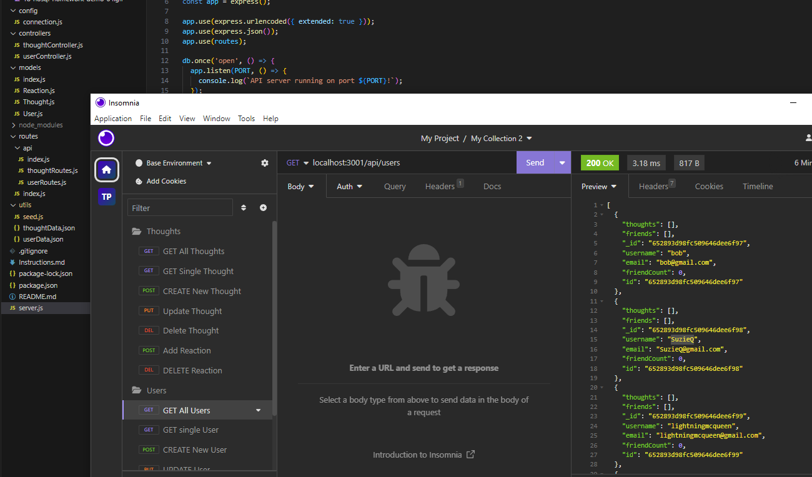

# NoSQL Social Network Database

## Description
The purpose of this application is to operate a database for a social network company uses MongoDB. 

There is a [Video Demo](https://drive.google.com/file/d/1SPxGYmr0EYE5TLTA2fDvHrS6K8nSj5XY/view?usp=sharing) hosted on Google Drive.

  ## Table of Contents
  * [Installation](#installation)
  * [License](#license)
  * [Badges](#badges)
  * [Contributions](#contributions)
  * [Questions](#questions)

## [Installation](#Table-of-Contents)
1. Install 'node.js' https://nodejs.org/en/download, if not installed already.

2. Clone this repo to your local computer https://github.com/tjansson-ui/NoSqlSocialNetwork

4. Install dependencies by typing `npm install` in the terminal's command line.

## [License](#table-of-contents)
[MIT License](https://opensource.org/licenses/MIT)

## [Badges](#table-of-contents)

## [Contributions](#table-of-contents)
This application was initiated as a project from the University of Wisconsin Coding Bootcamp. The project was designed and completed by Tor Jansson.

## [Questions](#Table-of-Contents)
If you have any questions contact developers here:

T. Jansson: [Github](https://github.com/tjansson-ui)
